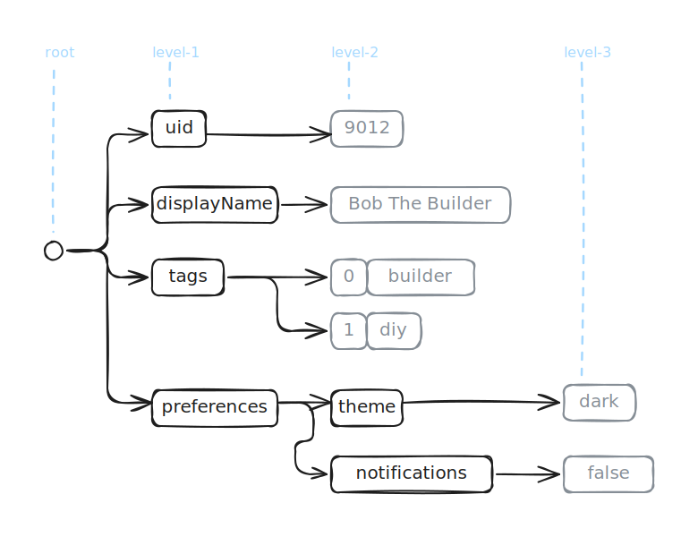

<style>
th, td {
  text-align: center;
  vertical-align: top;
  padding: 8px 16px;
}

.table-container {
  display: flex;
  justify-content: space-around;
  gap: 20px;
}

.col-view td:nth-child(1), .col-view th:nth-child(1):not([colspan]) { background-color: #FFFFE0; }
.col-view td:nth-child(2), .col-view th:nth-child(2) { background-color: #FFDAB9; }
.col-view td:nth-child(3), .col-view th:nth-child(3) { background-color: #E6E6FA; }
.col-view td:nth-child(4), .col-view th:nth-child(4) { background-color: #DDFADD; }
.col-view td:nth-child(5), .col-view th:nth-child(5) { background-color: #F0F8FF; }

.row-view tr:nth-child(1) td { background-color: #FFFFE0; }
.row-view tr:nth-child(2) td { background-color: #FFDAB9; }
.row-view tr:nth-child(3) td { background-color: #E6E6FA; }
.row-view tr:nth-child(4) td { background-color: #DDFADD; }

.col-view {
  border-spacing: 8px 0;
}

.row-view {
  border-spacing: 0 8px;
}

.record-container {
  display: flex;
}

.default-value {
  color: #555555;
}

/* to be removed later */
body {
  max-width: 800px;
  font-size: 20px;
  margin: 0 auto 220px;
}
</style>

# Introduction

_To be filled in later._

# Record Shredding And Assembly

Conceptually, record shredding is a flattening of a nested data structure into a flat, relational format. Record
assembly is the reconstructing of that shredded structure back into its original nested form.

Below is a visualization of a _UserProfile_ object which has three levels of nesting.


_Figure 1. Visualization of a nested data structure_

The primitive values appear in the leaf nodes at levels two and three. It is common to use the dot-separated notation to
represent accessing a leaf node value (e.g. _preferences.theme_ = _"dark"_). The array index notation is used to
represent accessing the individual values in the repeated (array) field like _tags_ (e.g. tags[0] = _"builder"_, tags
[1] = _"diy"_).

After shredding the flattened _UserProfile_ value looks like any other row in a relational table. The two array values
in _tags_ are expanded into separate rows. This is similar to using the _UNNEST_ function in SQL which takes the
array value in _tags_ as input, and returns rows for each element in the array.

<table class="col-view">
  <thead>
    <tr>
      <th colspan="5">Flattened UserProfile After Record Shredding</th>
    </tr>
    <tr>
      <th>uid</th>
      <th>displayName</th>
      <th>tags</th>
      <th>preferences.theme</th>
      <th>preferences.notifications</th>
    </tr>
  </thead>
  <tbody>
    <tr>
      <td>9012</td>
      <td>Bob The Builder</td>
      <td>builder</td>
      <td>dark</td>
      <td>false</td>
    </tr>
    <tr>
      <td>9012</td>
      <td>Bob The Builder</td>
      <td>diy</td>
      <td>dark</td>
      <td>false</td>
    </tr>
  </tbody>
</table>

Next record assembly takes these row values and the column names as input, to fully reconstruct the nested data
structure back to its original form.

```json
{
  "uid": "9012",
  "displayName": "Bob The Builder",
  "tags": [
    "builder",
    "diy"
  ],
  "preferences": {
    "theme": "dark",
    "notifications": false
  }
}
```

Record assembly also works with just a subset of columns. This is a useful feature which closely matches real-world
usage. Most queries only include a small set of columns relevant to the query. There is no good reason to materialize
the a complete _UserProfile_ if the query requires only parts of it.

If the columns specified in the query are _uid_ and _preferences.notifications_ then record assembly has to read
only these columns. It can skip the remaining columns which are not relevant to the query. The reassembled
_UserProfile_ object preserves its original structure but only contains these fields:

```json
{
  "uid": "9012",
  "preferences": {
    "notifications": false
  }
}
```

# Columnar Storage

There is an implicit assumption in how shredded data is organized. During record assembly given a subset of columns
it should be possible to read only those columns from storage and skip reading the remaining columns. That tells us
that the shredded data has to be organized by columns. The values of each column are stored next to each
other.

<table class="col-view">
  <thead>
    <tr>
      <th colspan="3">UserRole</th>
    </tr>
    <tr>
      <th>id</th>
      <th>username</th>
      <th>role</th>
    </tr>
  </thead>
  <tbody>
    <tr>
      <td>101</td>
      <td>Alice</td>
      <td>sender</td>
    </tr>
    <tr>
      <td>102</td>
      <td>Bob</td>
      <td>receiver</td>
    </tr>
    <tr>
      <td>103</td>
      <td>Eve</td>
      <td>eavesdropper</td>
    </tr>
    <tr>
      <td>104</td>
      <td>Trudy</td>
      <td>intruder</td>
    </tr>
  </tbody>
</table>

The _UserRole_ relation is stored as column stripes. This arrangement makes it possible to read only a specific
column without having to read related row values from the other columns. You can read only the _username_ column
values without having to read its associated values in the _id_, or _role_ columns.

This is known as columnar storage.

It is the standard for how data is organized internally in the storage engines of modern analytical databases like
ClickHouse and DuckDB.

There are also column-oriented data formats like Apache Parquet which are not tied to a specific database engine. A
Parquet file has wide support in variety of modern programming languages. You can also directly run SQL queries on a
Parquet file from databases like ClickHouse and DuckDB.

## Performance Benefits

The optimization where you read only the relevant columns from columnar storage is known as projection pushdown. By
reading only what is required, we save on disk I/O. This in turn reduces the memory footprint when the column values are
read into memory.

The data locality of column values being stored next to each other is crucial for query performance. The values can
be partitioned into chunks and processed in parallel on multiple CPU cores. This is known as data parallelism. The
other benefit of data locality is that scalar operations on data can instead be vectorized. It produces the same
results, but uses fewer instructions per data and executes faster.

These optimizations are commonly associated with flat, relational data. But with record shredding the
performance benefits of storage, retrieval and query execution now extends to nested data structures in shredded form.

---

### Introduction

TBD

### Record Shredding:

- Flattened representation of (conceptually) a nested data structure.
- Requires a schema
  - Repeated Fields
  - Optional Fields
- Enumerating Columns From Schema
- Concrete example: _UserProfile_

### Columnar Storage

- Implied by Record Assembly
- Performance Benefits
  - Projection Pushdown
  - Data Parallelism
  - Vectorization

### Shredding Challenges

- Structural variations: 1 schema : N instances

### Schema Columns

- Why schema ? (1 schema: N instances)
- Schema: optional, repeated fields
- Enumerating Columns From Schema

### Repetition Levels Are Complicated

- [[1,2], [3, 4]]

### Why Record Shredding Is Necessary?

- Direct efficient columnar representation for fast ad-hoc queries
- Why columnar for ad-hoc queries?
  - Read only the relevant columns (projection pushdown)
  - Data Parallelism
  - Vectorization

### Repetition Levels

- Is complicated and not trivial to understand or implement
- Concrete example: [[0, 1], [2, 3]]

---

# Recap: Flat, Relational Data

## Row-Major vs. Column-Major Representation

The data is stored in row-major order in transactional storage engines like PostgreSQL, MySQL or SQLite. This matches
the transactional access patterns which targets to read, modify or delete a specific row of data or a very small set of
rows. The filtering conditions of the query have high-selectivity. When reading a row all the column attributes in
the relation are materialized in main memory. Having the entire row contiguous in memory once fetched minimizes
additional disk I/O.

On the other hand in an analytical database like ClickHouse or DuckDB, the access pattern is different enough that
it makes sense to store the same data in column-major order. Data for each column is stored contiguously. This is
because analytical workloads are primarily read-only, scan-heavy, heavily utilize aggregations with an explicit
goal of summarizing the data. The primary advantage here is that only those columns which are relevant for a query
needs to be materialized in memory. For scan-heavy queries which often have low-selectivity, this has a significant
impact on minimizing disk I/O and reducing memory footprint.

<div class="table-container">
  <table class="col-view">
    <thead>
      <tr>
        <th colspan="3">column-major order</th>
      </tr>
      <tr>
        <th>id</th>
        <th>username</th>
        <th>role</th>
      </tr>
    </thead>
    <tbody>
      <tr>
        <td>101</td>
        <td>Alice</td>
        <td>sender</td>
      </tr>
      <tr>
        <td>102</td>
        <td>Bob</td>
        <td>receiver</td>
      </tr>
      <tr>
        <td>103</td>
        <td>Eve</td>
        <td>eavesdropper</td>
      </tr>
      <tr>
        <td>104</td>
        <td>Trudy</td>
        <td>intruder</td>
      </tr>
    </tbody>
  </table>

  <table class="row-view">
    <thead>
      <tr>
        <th colspan="3">row-major order</th>
      </tr>
      <tr>
        <th>id</th>
        <th>username</th>
        <th>role</th>
      </tr>
    </thead>
    <tbody>
      <tr>
        <td>101</td>
        <td>Alice</td>
        <td>sender</td>
      </tr>
      <tr>
        <td>102</td>
        <td>Bob</td>
        <td>receiver</td>
      </tr>
      <tr>
        <td>103</td>
        <td>Eve</td>
        <td>eavesdropper</td>
      </tr>
      <tr>
        <td>104</td>
        <td>Trudy</td>
        <td>intruder</td>
      </tr>
    </tbody>
  </table>
</div>

## Performance Benefits

The data locality in columnar storage is crucial for query performance. It enables data parallelism where different
blocks of column values can be processed in parallel on multiple CPU cores. It helps with replacing scalar
operations with vectorized processing. Together data parallelism and vectorized processing has a big impact in
making analytical queries execute faster and efficiently.

# Record Shredding

Record shredding is the act of breaking up nested data structures into a flat, relational format. From above, we know
the benefits of columnar representation for analytical workloads. By doing this, the benefits of data parallelism,
vectorization and efficient I/O extends to nested data structures as well. The ability to directly represent nested
data structures also leads to operational simplicity. A nested data structure doesn't have to be manually normalized
into relational form which is ready for ad-hoc querying. There is no human judgement required. The ad-hoc queries
are going to execute on direct columnar representation of the nested data structure. That is the promised land!

# Record Assembly

Record assembly is how the columnar representation is interpreted to reconstruct either fully or partially the
stored nested data structures. Similar to flat, relational data here too we want to read only the relevant columns
and ignore the rest. So the ability to partially reconstruct only the relevant parts of the nested data structure is
an important feature.

# Nested Data Structure

This is a place for claims:

- structural variation
- sparse
- can't shred without schema
- columns fall out from schema

## Schema: Optional & Repeated Fields

The figure 1. shows all the fields of a _UserProfile_ nested data structure.

A field has a name and a data type.

An _optional_ field is not mandatory. It does not have to be present in the instance of data. Consider _preferences.
theme_ which is composed of two optional fields. There are three possible variations:

1. Both the fields are present: _preferences.theme_.
2. The _theme_ field is not present: _preferences_.
3. Both fields are not present.

A _repeated_ field is an array of values and it can be empty. The element data type of repeated field can be a
primitive type like Integer, String or Boolean. The _tags_ field belongs to this category. The element data type can
also be a _Struct_.


Figure 1. Schema for UserProfile

## Enumerating Columns

In a data instance an optional field may not be present, and a repeated field can be empty. The schema makes it
possible to identify which columns are present in an instance of data, and more important which ones are not. From
the schema we can enumerate all the columns of the nested data structure.

A column is uniquely identified by the field names from root to leaf using a dot-separated notation. The
_UserProfile_ schema contains the following set of columns:

1. _uid_
2. _displayName_
3. _tags_
4. _preferences.theme_
5. _preferences.language_
6. _preferences.notifications_

## Logical Columnar View

These are examples of concrete instances of the _UserProfile_ schema defined in Figure 1. They have varying levels
of completeness.

<div class="record-container">

```json
{
  "uid": "1234",
  "displayName": "Alice Wonderland",
  "tags": [
    "reader",
    "dreamer"
  ]
}
```

```json
{
  "uid": "5678",
  "displayName": "Chris Coder",
  "tags": [
    "developer",
    "python",
    "oss"
  ],
  "preferences": {
    "theme": "light"
  }
}
```

```json
{
  "uid": "9012",
  "displayName": "Bob The Builder",
  "tags": [
    "builder",
    "diy"
  ],
  "preferences": {
    "theme": "dark",
    "notifications": false
  }
}
```

</div>

Let see how these examples map to a logical columnar view.

<table class="col-view">
  <thead>
    <tr>
      <th>uid</th>
      <th>displayName</th>
      <th>tags</th>
      <th>preferences.theme</th>
      <th>preferences.notifications</th>
    </tr>
  </thead>
  <tbody>
    <tr>
      <td>1234</td>
      <td>Alice Wonderland</td>
      <td>[reader, dreamer]</td>
      <td></td>
      <td></td>
    </tr>
    <tr>
      <td>5678</td>
      <td>Chris Coder</td>
      <td>[developer, python, oss]</td>
      <td>light</td>
      <td></td>
    </tr>
    <tr>
      <td>9012</td>
      <td>Bob The Builder</td>
      <td>[builder, diy]</td>
      <td>dark</td>
      <td>false</td>
    </tr>
  </tbody>
</table>

The _tag_ array values can be expanded further so that each value is in its own separate row. This is similar to the
functionality of the _unnest_ function in SQL.

<table class="col-view">
  <thead>
    <tr>
      <th>uid</th>
      <th>displayName</th>
      <th>tags</th>
      <th>preferences.theme</th>
      <th>preferences.notifications</th>
    </tr>
  </thead>
  <tbody>
    <tr>
      <td>1234</td>
      <td>Alice Wonderland</td>
      <td>reader</td>
      <td></td>
      <td></td>
    </tr>
    <tr>
      <td>1234</td>
      <td>Alice Wonderland</td>
      <td>dreamer</td>
      <td></td>
      <td></td>
    </tr>
    <tr>
      <td>5678</td>
      <td>Chris Coder</td>
      <td>developer</td>
      <td>light</td>
      <td></td>
    </tr>
    <tr>
      <td>5678</td>
      <td>Chris Coder</td>
      <td>python</td>
      <td>light</td>
      <td></td>
    </tr>
    <tr>
      <td>5678</td>
      <td>Chris Coder</td>
      <td>oss</td>
      <td>light</td>
      <td></td>
    </tr>
    <tr>
      <td>9012</td>
      <td>Bob The Builder</td>
      <td>builder</td>
      <td>dark</td>
      <td>false</td>
    </tr>
    <tr>
      <td>9012</td>
      <td>Bob The Builder</td>
      <td>diy</td>
      <td>dark</td>
      <td>false</td>
    </tr>
  </tbody>
</table>

After expanding the _tags_ the total number of rows exploded. There are more holes (properties which are not present)
now in _preferences.theme_ and _preferences.notifications_ columns.

The holes can be filled by defining sensible default values.

<table class="col-view">
  <thead>
    <tr>
      <th>uid</th>
      <th>displayName</th>
      <th>tags</th>
      <th>preferences.theme</th>
      <th>preferences.notifications</th>
    </tr>
  </thead>
  <tbody>
    <tr>
      <td>1234</td>
      <td>Alice Wonderland</td>
      <td>reader</td>
      <td class="default-value">system</td>
      <td class="default-value">true</td>
    </tr>
    <tr>
      <td>1234</td>
      <td>Alice Wonderland</td>
      <td>dreamer</td>
      <td class="default-value">system</td>
      <td class="default-value">true</td>
    </tr>
    <tr>
      <td>5678</td>
      <td>Chris Coder</td>
      <td>developer</td>
      <td>light</td>
      <td class="default-value">true</td>
    </tr>
    <tr>
      <td>5678</td>
      <td>Chris Coder</td>
      <td>python</td>
      <td>light</td>
      <td class="default-value">true</td>
    </tr>
    <tr>
      <td>5678</td>
      <td>Chris Coder</td>
      <td>oss</td>
      <td>light</td>
      <td class="default-value">true</td>
    </tr>
    <tr>
      <td>9012</td>
      <td>Bob The Builder</td>
      <td>builder</td>
      <td>dark</td>
      <td>false</td>
    </tr>
    <tr>
      <td>9012</td>
      <td>Bob The Builder</td>
      <td>diy</td>
      <td>dark</td>
      <td>false</td>
    </tr>
  </tbody>
</table>

This logical columnar representation now looks similar to flat, relational data in tables. It is in a form which
is ready for querying. This is the primary goal of record shredding, so that we can interactively query nested data
structures the same as flat, relational data.

This is not an efficient representation.

---

Real-world nested datasets are sparse.

But this is not an efficient representation.

There is a lot of data redundancy from expanding repeated fields. What if a repeated fields contains thousands, or tens
of thousands of elements, or more? What if there are multiple repeated fields?

Typically, real-world nested datasets are sparse, as only a subset of optional fields are populated. Even when a
field is not present in the original data instance, physical storage has to be allocated to store the default value.


[//]: # (```graphql)

[//]: # (type UserProfile {)

[//]: # (  uid: ID!                  # This field is mandatory)

[//]: # (  displayName: String       # This is an optional field)

[//]: # (  tags: [String!]           # This is a repeated &#40;array&#41; field)

[//]: # (  preferences: Preferences  # This is an optional nested field)

[//]: # (})

[//]: # ()

[//]: # (# All fields in this type are optional)

[//]: # (type Preferences {)

[//]: # (  theme: String           # Values can be "dark", "light" or "system".)

[//]: # (  language: String        # Uses BCP 47 language tags, e.g., "en-US".)

[//]: # (  notifications: Boolean)

[//]: # (})

[//]: # (```)

[//]: # ()

[//]: # (The `uid` field is the only mandatory field. So a valid instance can be created with the `uid` alone. The other)

[//]: # (fields can be progressively added.)

[//]: # ()

[//]: # (The `displayName` and `preferences` are optional fields.)

[//]: # ()

[//]: # (The `tags` is a repeated &#40;array&#41; field. The schema does not convey any information about the cardinality of this)

[//]: # (field. That can be known only after parsing a raw nested data structure instance.)

[//]: # ()

[//]: # (The `preferences` adds a level of nesting. All the fields in it are also optional.)

[//]: # ()

[//]: # (This is the schema definition for a nested data structure. The syntax I have used here is the GraphQL Schema)

[//]: # (Definition Language. It may as well be a definition written in a programming language or using the syntax of an)

[//]: # (interface definition language like Thrift or Protocol Buffers. It does not matter. The relevant part is how we logically)

[//]: # (define the fields:)

[//]: # ()

[//]: # (- Is a field optional or mandatory?)

[//]: # (- Is this a repeated &#40;array&#41;?)

[//]: # (- What is the data type of the field?)

[//]: # (- What is the name of the field?)

[//]: # ()

[//]: # (<div class="record-container">)

[//]: # ()

[//]: # (```json)

[//]: # ({)

[//]: # (  "uid": "a1b2c3d4",)

[//]: # (  "displayName": "Alice Wonderland",)

[//]: # (  "tags": [)

[//]: # (    "reader",)

[//]: # (    "dreamer")

[//]: # (  ])

[//]: # (})

[//]: # (```)

[//]: # ()

[//]: # (```json)

[//]: # ({)

[//]: # (  "uid": "e5f6g7h8",)

[//]: # (  "displayName": "Chris Coder",)

[//]: # (  "tags": [)

[//]: # (    "developer",)

[//]: # (    "python",)

[//]: # (    "oss")

[//]: # (  ],)

[//]: # (  "preferences": {)

[//]: # (    "theme": "light")

[//]: # (  })

[//]: # (})

[//]: # (```)

[//]: # ()

[//]: # (```json)

[//]: # ({)

[//]: # (  "uid": "i9j0k1l2",)

[//]: # (  "displayName": "Bob The Builder",)

[//]: # (  "tags": [)

[//]: # (    "builder",)

[//]: # (    "diy")

[//]: # (  ],)

[//]: # (  "preferences": {)

[//]: # (    "theme": "dark",)

[//]: # (    "notifications": true)

[//]: # (  })

[//]: # (})

[//]: # (```)

[//]: # ()

[//]: # (</div>)

[//]: # ()

[//]: # ()
