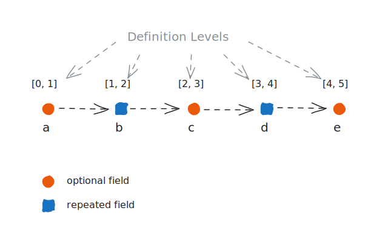
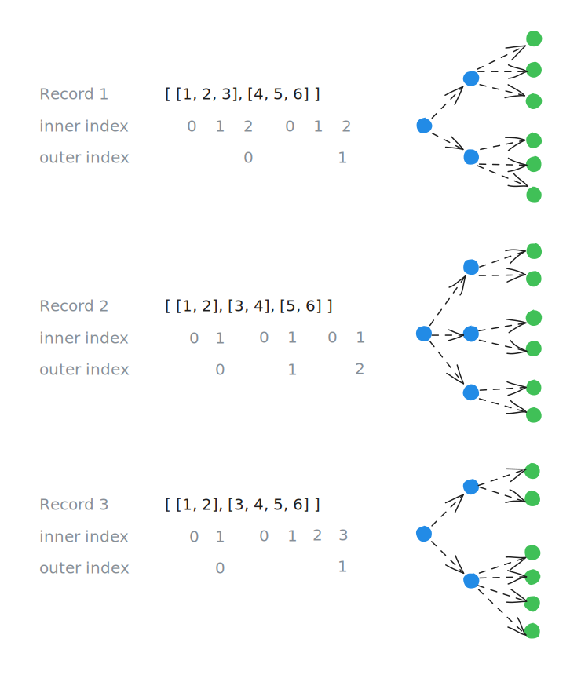

<style>
th, td {
  text-align: center;
  vertical-align: top;
  padding: 8px 16px;
}

.table-container {
  display: flex;
  justify-content: space-around;
  gap: 20px;
}

.col-view td:nth-child(1), .col-view th:nth-child(1):not([colspan]) { background-color: #FFFFE0; }
.col-view td:nth-child(2), .col-view th:nth-child(2) { background-color: #FFDAB9; }
.col-view td:nth-child(3), .col-view th:nth-child(3) { background-color: #E6E6FA; }
.col-view td:nth-child(4), .col-view th:nth-child(4) { background-color: #DDFADD; }
.col-view td:nth-child(5), .col-view th:nth-child(5) { background-color: #F0F8FF; }

.row-view tr:nth-child(1) td { background-color: #FFFFE0; }
.row-view tr:nth-child(2) td { background-color: #FFDAB9; }
.row-view tr:nth-child(3) td { background-color: #E6E6FA; }
.row-view tr:nth-child(4) td { background-color: #DDFADD; }

.col-view {
  border-spacing: 8px 0;
}

.row-view {
  border-spacing: 0 8px;
}

.record-container {
  display: flex;
}

.default-value {
  color: #555555;
}

/* to be removed later */
body {
  max-width: 800px;
  font-size: 20px;
  margin: 0 auto 220px;
}
</style>

# Introduction

In the 2010 VLDB
paper, [Dremel: Interactive Analysis of Web-Scale Datasets](https://static.googleusercontent.com/media/research.google.com/en//pubs/archive/36632.pdf)
reports being able to run ad-hoc analytical queries over a _trillion-row_ tables in seconds. The contents of the
table were nested data structures and not flat, relational data. The compressed size of the dataset exceeded 100TB
and the nested data structures contained around 50 fields.

The Dremel (underlying engine of Google BigQuery) folks invented a representation which for the first time made it
possible to represent nested data structures directly in the internal storage format of Dremel. This reduced the
average query execution time from hours to seconds. The provide the example of a query to compute the average number
of terms in a field. To compute the results the query had to scan 87TB of records stored in its original form,
compared to just 0.5TB of compressed data in the new representation. That is an impressive reduction in data scanned
from storage to compute query results.

This technique was directly adopted by Apache Parquet file format for efficiently storing and querying nested data
structures.

The design of the Dremel encoding is deceptively simple. In an attempt to implement my own version of this from
scratch - https://github.com/jcsherin/denester, I kept thinking I understand this enough to implement it and I can
also convince myself that it works correctly, but the intuition behind it was missing. Slogging through the
implementation after several tiny moments of epiphany, I finally understood its essence. This blog post is an
attempt to write it down not as a how to implement it, but really get to the bottom of why it works through first
principles reasoning and capture some of the magic and elegance in its design.

# Record Shredding And Assembly

Conceptually, record shredding is a flattening of a nested data structure into a flat, relational format. Record
assembly is the reconstructing of that shredded structure back into its original nested form.

Below is a visualization of a _UserProfile_ object which has three levels of nesting.


_Figure 1. Visualization of a nested data structure_

The primitive values appear in the leaf nodes at levels two and three. It is common to use the dot-separated notation to
represent accessing a leaf node value (e.g. _preferences.theme_ = _"dark"_). The array index notation is used to
represent accessing the individual values in the repeated (array) field like _tags_ (e.g. tags[0] = _"builder"_, tags
[1] = _"diy"_).

After shredding the flattened _UserProfile_ value looks like any other row in a relational table. The two array values
in _tags_ are expanded into separate rows. This is similar to using the _UNNEST_ function in SQL which takes the
array value in _tags_ as input, and returns rows for each element in the array.

<table class="col-view">
  <thead>
    <tr>
      <th colspan="5">Flattened UserProfile After Record Shredding</th>
    </tr>
    <tr>
      <th>uid</th>
      <th>displayName</th>
      <th>tags</th>
      <th>preferences.theme</th>
      <th>preferences.notifications</th>
    </tr>
  </thead>
  <tbody>
    <tr>
      <td>9012</td>
      <td>Bob The Builder</td>
      <td>builder</td>
      <td>dark</td>
      <td>false</td>
    </tr>
    <tr>
      <td>9012</td>
      <td>Bob The Builder</td>
      <td>diy</td>
      <td>dark</td>
      <td>false</td>
    </tr>
  </tbody>
</table>

## Record Assembly

Next record assembly takes these row values and the column names as input, to fully reconstruct the nested data
structure back to its original form.

```json
{
  "uid": "9012",
  "displayName": "Bob The Builder",
  "tags": [
    "builder",
    "diy"
  ],
  "preferences": {
    "theme": "dark",
    "notifications": false
  }
}
```

Record assembly also works with just a subset of columns. This is a useful feature which closely matches real-world
usage. Most queries only include a small set of columns relevant to the query. There is no good reason to materialize
the a complete _UserProfile_ if the query requires only parts of it.

If the columns specified in the query are _uid_ and _preferences.notifications_ then record assembly has to read
only these columns. It can skip the remaining columns which are not relevant to the query. The reassembled
_UserProfile_ object preserves its original structure but only contains these fields:

```json
{
  "uid": "9012",
  "preferences": {
    "notifications": false
  }
}
```

## Columnar Data Layout

It is implied above that record shredding and assembly uses a columnar data layout. And this is critical for
reassembly of partial projection from the shredded values in storage. It is an efficient representation because only
the subset of columns required for reassembly have to be scanned.

Typically relational data is associated with row storage. If you access the row (say _id_ = 103) it retrieves all
the related attributes from storage and writes _(103, "Eve", "eavesdropper")_ to memory. This matches the access
patterns of transactional applications which needs to read or write a single row or a very small set of rows at a
time. The row storage is optimized for heavy read-write workloads which works on a single row or a very small set of
rows.

<table class="row-view">
  <thead>
    <tr>
      <th colspan="3">Row Format</th>
    </tr>
    <tr>
      <th>id</th>
      <th>username</th>
      <th>role</th>
    </tr>
  </thead>
  <tbody>
    <tr>
      <td>101</td>
      <td>Alice</td>
      <td>sender</td>
    </tr>
    <tr>
      <td>102</td>
      <td>Bob</td>
      <td>receiver</td>
    </tr>
    <tr>
      <td>103</td>
      <td>Eve</td>
      <td>eavesdropper</td>
    </tr>
    <tr>
      <td>104</td>
      <td>Trudy</td>
      <td>intruder</td>
    </tr>
  </tbody>
</table>

The row storage format is not optimized for access patterns of analytical queries. For example to compute the value
of _COUNT (DISTINCT role)_ all data will have to be retrieved from storage, written to memory and scanned to
compute the result. Even though the _id_ and _username_ columns serves no purpose in computing the final result,
they are still materialized into memory from storage. This is unavoidable because row value are stored next to each
other.

If the data is instead stored in a columnar layout, only the _role_ column needs to be scanned to compute the final
result. In this layout the values of a column are stored next to each other.

<table class="col-view">
  <thead>
    <tr>
      <th colspan="3">Columnar Format</th>
    </tr>
    <tr>
      <th>id</th>
      <th>username</th>
      <th>role</th>
    </tr>
  </thead>
  <tbody>
    <tr>
      <td>101</td>
      <td>Alice</td>
      <td>sender</td>
    </tr>
    <tr>
      <td>102</td>
      <td>Bob</td>
      <td>receiver</td>
    </tr>
    <tr>
      <td>103</td>
      <td>Eve</td>
      <td>eavesdropper</td>
    </tr>
    <tr>
      <td>104</td>
      <td>Trudy</td>
      <td>intruder</td>
    </tr>
  </tbody>
</table>

In database terms this optimization is known as _projection pushdown_. It helps optimize the amount of disk I/O
necessary for scanning data from physical storage.

# Schema

The schema is the single source of truth which is used for implementing record shredding and assembly.

A schema is a collection of _fields_. Each _field_ has a name, a data type and a marker which identifies if the
field is optional or not.

A _repeated_ field is an array of values. The data type can be either a primitive type or even a struct data type. The
order of values is important and is preserved during shredding and reassembly.

A _Struct_ data type adds another level of nesting and contains one or more fields.


_Figure 2. Schema of UserProfile object_

The example below (same as Figure 1.) is a valid construction of the _UserProfile_ schema. The _preferences.language_
property is not present in this instance. In the schema, the _language_ field is marked as an optional field.

```json
{
  "uid": "9012",
  "displayName": "Bob The Builder",
  "tags": [
    "builder",
    "diy"
  ],
  "preferences": {
    "theme": "dark",
    "notifications": false
  }
}
```

In the next example, the _preferences_ property is not present. In the schema, the _preferences_ field is marked as an
optional field.

```json
{
  "uid": "1234",
  "displayName": "Alice Wonderland",
  "tags": [
    "reader",
    "dreamer"
  ]
}
```

In the next example, the _preferences.language_ and _preferences.notifications_ properties are not present. In the
schema both the fields are marked as optional.

```json
{
  "uid": "5678",
  "displayName": "Chris Coder",
  "tags": [
    "developer",
    "python",
    "oss"
  ],
  "preferences": {
    "theme": "light"
  }
}
```

The recurring theme here is that by looking at an instance of a nested structure by itself, it is not possible to
identify which properties are missing from it. We need the schema to validate an instance and also know which
properties are not present in it.

# The Dremel Encoding

A desirable property of record shredding is that it should not inflate the size of the stored nested data structure.
If the shredded encoding ended up being smaller than directly storing the nested data structure itself, that will
be a great win.

The abstract representation of record shredding introduced in the beginning is not well-designed. The most obvious
issue is the data redundancy required for the _tags_ repeated field. The number of rows in this representation
depends on the cardinality (number of elements) of the _tags_ property.

Also to keep complexity low without sacrificing the essence of how record shredding works we deliberately did not tackle
the problem of how missing properties should be represented.

The three examples of _UserProfile_ from above after shredding using the Dremel technique is represented as shown below.

<table class="col-view">
  <thead>
    <tr>
      <th colspan="5">Dremel Encoding</th>
    </tr>
    <tr>
      <th>uid</th>
      <th>displayName</th>
      <th>tags</th>
      <th>preferences.theme</th>
      <th>preferences.notifications</th>
    </tr>
  </thead>
  <tbody>
    <tr>
      <td>1234</td>
      <td>Alice Wonderland</td>
      <td>reader</td>
      <td>light</td>
      <td>false</td>
    </tr>
    <tr>
      <td>5678</td>
      <td>Chris Coder</td>
      <td>dreamer</td>
      <td>dark</td>
      <td></td>
    </tr>
    <tr>
      <td>9012</td>
      <td>Bob The Builder</td>
      <td>developer</td>
      <td></td>
      <td></td>
    </tr>
    <tr>
      <td></td>
      <td></td>
      <td>python</td>
      <td></td>
      <td></td>
    </tr>
    <tr>
      <td></td>
      <td></td>
      <td>oss</td>
      <td></td>
      <td></td>
    </tr>
    <tr>
      <td></td>
      <td></td>
      <td>builder</td>
      <td></td>
      <td></td>
    </tr>
    <tr>
      <td></td>
      <td></td>
      <td>diy</td>
      <td></td>
      <td></td>
    </tr>
  </tbody>
</table>

This representation wastes no space for representing properties which are missing in the values. The cardinality of
a repeated field like _tags_ has no effect on other columns. This representation ends up taking less space than
directly storing the _UserProfile_ objects.

But they do not line up nicely into rows which informs you where a record begins and ends just by visual inspection.
So if you are thinking there is not enough information here to be able to reassemble the original values, you are on
the right track.

## Structure is Metadata

A schema definition leads to a variety of possible structures. This can be seen in the below visualization of the three
_UserProfile_ examples introduced earlier. Without the distraction of labels, we can look at the structure by itself.


_Figure 3. Structure of UserProfile Objects_

What causes the structural variability?

If any of the optional fields are not present, or if a repeated (array) field is empty it manifests as a hole in the
structure. The cardinality of the repeated field also modifies the structure.

The key insight in Dremel encoding is to distill both these sources of structural variability into a computed
numeric value during the process of record shredding. By interpreting the values extracted from the leaf nodes
together with the two derived metadata values the original nested data structure can be reassembled.

In Dremel these metadata columns are known as _definition levels_ and _repetition levels_.

# How Definition Levels Work

Consider a single nested path of interleaving optional and repeated fields. The definition level is computed by
counting the optional fields which are present, and the repeated fields which are present and not empty.


_Figure 4. Annotated definition levels for a nested path_

The example path _a.b.c.d.e_ shown above contains three optional fields and two repeated fields. The definition
levels for this path will be in the range (inclusive) [0, 5]. The calculation is simple. If a field is present then
we increment the definition level count. We continue doing this for each optional and repeated field until the path
terminates. The final count tell us exact point at which a path terminates.

In this example a definition level of zero indicates that the path is not present in the data instance. If a path
defined in the schema contains only required fields then the definition levels will be always zero for all values.
In this case we do not need to compute or store the definition levels. For example, the _uid_ is a required field in
the _UserProfile_ schema. We can simply skip computing definition levels as there are no optional or repeated fields
in this path.

<table>
  <thead>
    <tr>
      <th>No.</th>
      <th>Path</th>
      <th>Definition Level</th>
      <th>Notes</th>
    </tr>
  </thead>
  <tbody>
    <tr>
      <td>1</td>
      <td>Ø</td>
      <td>0</td>
      <td>Empty path. The field <em>a</em> is not present.</td>
    </tr>
    <tr>
      <td>2</td>
      <td>a</td>
      <td>1</td>
      <td>The repeated field <em>b</em> is empty and not present.</td>
    </tr>
    <tr>
      <td>3</td>
      <td>a.b</td>
      <td>2</td>
      <td>The optional field <em>c</em> is not present.</td>
    </tr>
    <tr>
      <td>4.</td>
      <td>a.b.c</td>
      <td>3</td>
      <td>The repeated field <em>d</em> is not present.</td>
    </tr>
    <tr>
      <td>5</td>
      <td>a.b.c.d</td>
      <td>4</td>
      <td>The optional field <em>e</em> is not present.</td>
    </tr>
    <tr>
      <td>6.</td>
      <td>a.b.c.d.e</td>
      <td>5</td>
      <td>All the fields in this path are present.</td>
    </tr>
  </tbody>
</table>

# How Repetition Levels Work

The computation of repetition levels is complicated relative to definition levels.

The repetition level is a count of the repeated fields in path. The _n<sup>th</sup>_ repeated field has a repetition
level of _n_. Non-repeated fields contribute to overall nesting of the structure but does not increment the
repetition level count.

To demarcate the beginning of a new list the first element inherits the repetition level of its parent repeated
field. The subsequent elements in the list have a repetition level equal to the repeated field.

The first repeated field has a repetition level of one. But it does not have a parent. So the repetition level of
the first element is chosen to be zero. This is a special case. If the data type of the first repeated field is
non-primitive, then the first element in the nested repeated field will inherit the repetition level value of zero.
This is repeated for additional levels of nesting.

The zero repetition level therefore is valuable in identifying record boundaries. It indicates the start of a new
record.

## How Repetition Levels Capture Nested Structure

All three examples in Figure 5. have the same sequence of values but the nested list structure is different in each
case. By working through this example it will become evident how repetition levels correctly encodes the different
structures making it possible to correctly reassemble the original nested data structure.


_Figure 5. Nested repeated fields with similar values but different structures_

Let us begin with _Record 1_ and for improved readability substitute the inner lists with variable names _x_ and _y_.

_[x, y]_

The goal here is to compute the repetition levels for _x_ and _y_ in the first repeated field.

<table>
  <thead>
    <tr><th colspan="4">Outer List</th></tr>
    <tr>
      <th>Variable Name</th>
      <th>Value</th>
      <th>Repetition Level</th>
      <th>Reason</th>
    </tr>
  </thead>
  <tbody>
    <tr>
      <td>x</td>
      <td>[1, 2, 3]</td>
      <td>0</td>
      <td>Beginning of a new record.</td>
    </tr>
    <tr>
      <td>y</td>
      <td>[4, 5, 6]</td>
      <td>1</td>
      <td>Same as repetition level of outer list.</td>
    </tr>
  </tbody>
</table>

Next let us proceed with calculating the repetition levels for _x_ (first inner list).

<table>
  <thead>
    <tr><th colspan="3">First Inner List (x)</th></tr>
    <tr>
      <th>Value</th>
      <th>Repetition Level</th>
      <th>Reason</th>
    </tr>
  </thead>
  <tbody>
    <tr>
      <td>1</td>
      <td>0</td>
      <td>First element inherits repetition level of parent (see x)</td>
    </tr>
    <tr>
      <td>2</td>
      <td>2</td>
      <td>Same as repetition level of inner list which is the second repeated field.</td>
    </tr>
    <tr>
      <td>3</td>
      <td>2</td>
      <td>Same as repetition level of inner list which is the second repeated field.</td>
    </tr>
  </tbody>
</table>

Similar line of reason applies for the next element _y_ (second inner list).

<table>
  <thead>
    <tr><th colspan="3">Second Inner List (y)</th></tr>
    <tr>
      <th>Value</th>
      <th>Repetition Level</th>
      <th>Reason</th>
    </tr>
  </thead>
  <tbody>
    <tr>
      <td>4</td>
      <td>1</td>
      <td>First element inherits repetition level of parent (see y)</td>
    </tr>
    <tr>
      <td>5</td>
      <td>2</td>
      <td>Same as repetition level of inner list which is the second repeated field.</td>
    </tr>
    <tr>
      <td>6</td>
      <td>2</td>
      <td>Same as repetition level of inner list which is the second repeated field.</td>
    </tr>
  </tbody>
</table>

Merging both the tables we get.

<table>
  <caption>Final Result</caption>
  <tbody>
    <tr>
      <th>Value</th>
      <td>1</td>
      <td>2</td>
      <td>3</td>
      <td>4</td>
      <td>5</td>
      <td>6</td>
    </tr>
    <tr>
      <th>Repetition Level</th>
      <td>0</td>
      <td>2</td>
      <td>2</td>
      <td>1</td>
      <td>2</td>
      <td>2</td>
    </tr>
  </tbody>
</table>

This is the final computed repetition levels for all three examples. You are free to check the results yourself.

<table>
  <caption>Repetition Levels</caption>
  <tbody>
    <tr>
      <th>values</th>
      <td>1</td>
      <td>2</td>
      <td>3</td>
      <td>4</td>
      <td>5</td>
      <td>6</td>
    </tr>
    <tr>
      <th>Record 1</th>
      <td>0</td>
      <td>2</td>
      <td>2</td>
      <td>1</td>
      <td>2</td>
      <td>2</td>
    </tr>
    <tr>
      <th>Record 2</th>
      <td>0</td>
      <td>2</td>
      <td>1</td>
      <td>2</td>
      <td>1</td>
      <td>2</td>
    </tr>
    <tr>
      <th>Record 3</th>
      <td>0</td>
      <td>2</td>
      <td>1</td>
      <td>2</td>
      <td>2</td>
      <td>2</td>
    </tr>
    <tr>
      <th>definition levels</th>
      <td>2</td>
      <td>2</td>
      <td>2</td>
      <td>2</td>
      <td>2</td>
      <td>2</td>
    </tr>
  </tbody>
</table>

The definition levels is identical for all three records and not useful for learning about the structure of the
records. However, the repetition levels vary for each record. We can distinctly identify the start of a new record
with by zero repetition level. The start of new list within a record is identifiable by the change in repetition level.

## When a repeated field is empty

This record shredding walk through will show how both definition and repetition levels are interpreted together to
identify empty repeated fields.

_Record 1_: [ [1, 2], [], [3] ]

_Record 2_: [ [], [4, 5, 6], []]

Let us begin with _Record 1_ and like earlier substitute the inner lists with variable names: _x_, _y_ and _z_.

| Variable Name | Value  | Def | Rep | Reason                                                                          |
|---------------|--------|-----|-----|---------------------------------------------------------------------------------|
| x             | [1, 2] | 1   | 0   | Def=1, first repeated field (outer list). <br/>Rep=0, beginning of a new record |
| y             | []     | 1   | 1   | Rep=1, same as repetition level of repeated field (outer list)                  |
| z             | [3]    | 1   | 1   | Same as above.                                                                  |

Let us now continue with _Record 2_. Like earlier let us substitute the inner lists with variable names: _p_, _q_
and _r_.

| Variable Name | Value   | Def | Rep | Reason                                                                          |
|---------------|---------|-----|-----|---------------------------------------------------------------------------------|
| p             | []      | 1   | 0   | Def=1, first repeated field (outer list). <br/>Rep=0, beginning of a new record |
| q             | [4,5,6] | 1   | 1   | Rep=1, same as repetition level of repeated field (outer list)                  |
| r             | []      | 1   | 1   | Same as above.                                                                  |

Next let us process all the inner list elements in both records.

| Value | Def | Rep | Reason                                                                                                                   |
|-------|-----|-----|--------------------------------------------------------------------------------------------------------------------------|
| 1     | 2   | 0   | Def=2, second repeated field.<br/> Rep=0, Inherited from parent (outer list) because this is the first element (see x).  |
| 2     | 2   | 2   | Rep=2, same as repetition level of repeated field (inner list)                                                           |
| NULL  | 1   | 1   | Def=1, as inner list is empty (see y). Rep=1, Same as final non-empty repeated field (outer list)                        |
| NULL  | 1   | 0   | Def=1, inner list is empty (see p). Rep=0, Inherited from parent (outer list) because this is the first element (see p). |
| 4     | 2   | 2   | Def=2, second repeated field. <br/> Rep=2, same as repetition level of repeated field (inner list)                       |
| 5     | 2   | 2   | Same as above.                                                                                                           |
| 6     | 2   | 2   | Same as above.                                                                                                           |
| NULL  | 1   | 1   | Def=1, inner list is empty (see r). Rep=1, same as final non-empty repeated field (outer list)                           |

In the physical representation the NULL values do not have to be stored.

|           |   |   |   |   |   |   |   |   |
|:----------|:-:|:-:|:-:|:-:|:-:|:-:|:-:|:-:|
| **Value** | 1 | 2 | 4 | 5 | 6 |   |   |   |
| **Def**   | 2 | 2 | 1 | 1 | 2 | 2 | 2 | 1 |
| **Rep**   | 0 | 2 | 1 | 0 | 2 | 2 | 2 | 1 |

During record assembly the NULL value or empty repeated field can be inferred by interpreting the definition levels
together with the repetition levels.

In this example the definition level is 1 after the value 2. The repetition level is not zero. This tells us that we
are still within the outer list of the first record, but this is an empty list. So even without physically storing
the NULL value we can infer its presence and recreate the empty list inside _Record 1_.

The next definition level is again 1, but the repetition level has now changed to zero. This tell us that a new
record has started, but the first inner list element is empty. This matches the original structure of _Record 2_.

# Conclusion
