Lately, I've been poking around record shredding and needed a dataset of nested data structures for tracing query execution of shredded data. For this, I implemented a data generator which follows a [Zipfian-like] distribution. The generated data is staged in-memory as [Arrow RecordBatches], and then written to disk as Parquet files.

[Zipfian-like]: https://en.wikipedia.org/wiki/Zipf%27s_law
[Arrow RecordBatches]: https://arrow.apache.org/rust/parquet/arrow/index.html

The baseline version I wrote is a simple pipeline using Rust MPSC which connects multiple data generation (producer) threads to a single Parquet writer (consumer) thread. For a nested dataset of 10 million rows, it ~3.7s to complete. In this post, we'll see how a sequence of performance optimizations, reduced the total runtime to ~440ms (8x speedup).

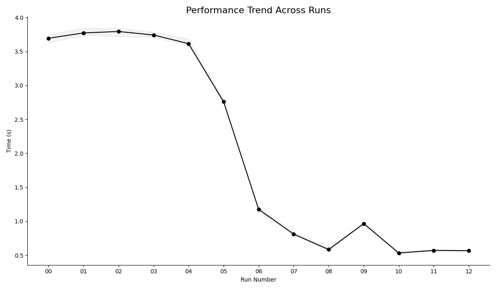

<figcaption>Fig 1. The performance trend across a sequence of code optimizations, measured using <code>hyperfine</code>. The black line indicates the median runtime in seconds, while the shaded area indicates the range between min and max runtime.</figcaption>

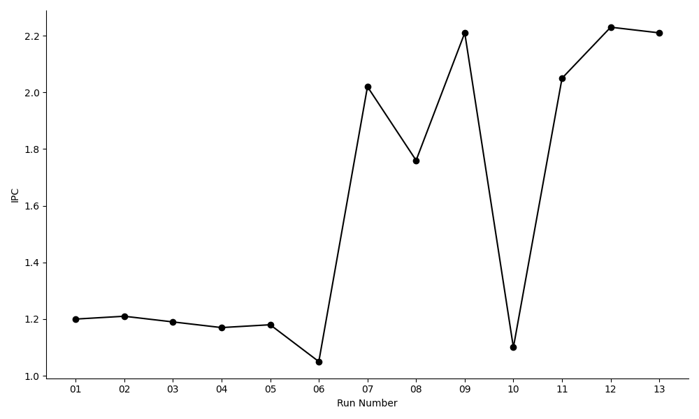

This chart displays only improvements in total runtime, which does not tell the whole story. While some optimizations here show no difference in the total runtime, the improvements came from higher IPC (instructions per cycle), fewer cache misses and fewer branch mispredictions.

A string interning optimization (no. 9) looked like a guaranteed win. It was introduced to eliminate a lot of small string allocations in the data generation (producer) threads. The performance got worse (more on this later in this post) and the change had to be reverted. This strongly reinforces, the importance of measurements and profiling data for knowing unambiguously if a code optimization made an improvement or did the opposite.

All benchmarks were run on a Linux machine with the following configuration:

- Ubuntu 24.04.2 LTS (Kernel 6.8)
- AMD Ryzen 7 PRO 8700GE (8 Cores, 16 Threads)
- 64 GB of DDR5-5600 ECC RAM
- 512 GB NVMe SSDs.

<nav class="toc" aria-labelledby="toc-heading">
  <h2 id="toc-heading">Table of Contents</h2>
  <ol>
    <li><a href="#background">Background</a></li>
    <li>
        <a href="#phase-1:-getting-started">Phase 1: Getting Started</a>
        <ul>
            <li><a href="#01:-use-a-dictionary-data-type">01: Use a Dictionary Data Type</a></li>
            <li><a href="#02:-eliminate-intermediate-vector-allocation">02: Eliminate Intermediate Vector Allocation</a></li>
            <li><a href="#03:-preallocate-a-string-buffer">03: Preallocate a String Buffer</a></li>
            <li><a href="#04:-preallocate-a-string-buffer-2">04: Preallocate a String Buffer 2</a></li>
            <li><a href="#why-is-the-runtime-unchanged">Why is the Runtime Unchanged?</a></li>
        </ul>
    </li>
    <li>
      <a href="#phase-2:-architectural-changes">Phase 2: Architectural Changes</a>
      <ul>
        <li><a href="#05:-increase-parquet-encoding-bandwidth">05: Increase Parquet Encoding Bandwidth</a></li>
        <li><a href="#06:-make-data-generation-lightweight">06: Make Data Generation Lightweight</a></li>
        <li><a href="#07:-increase-parquet-writer-threads">07: Increase Parquet Writer Threads</a></li>
        <li><a href="#08:-introduce-thread-local-state">08: Introduce Thread-Local State</a></li>
        <li><a href="#measuring-impact">Measuring Impact</a></li>
      </ul>
    </li>
    <li>
        <a href="#phase-3:-a-performance-regression">Phase 3: A Performance Regression</a>
    </li>
    <li>
        <a href="#phase-4:-micro-optimizations">Phase 4: Micro-Optimizations</a>
    </li>
</ol>
</nav>

## Background

The program is a CLI tool for generating a target number of rows of nested data structures and then written to disk in Parquet format.

Nested data structures do not naturally fit into a flat columnar format. Record shredding is a process which converts the nested data into a flat, columnar format while preserving the original structural hierarchy of the raw data.

The generated data follows a [Zipfian-like] distribution. It is staged in memory as [Arrow RecordBatches], before being written to disk as Parquet files.

The data is generated in parallel using a [Rayon] thread pool. Then data generator threads (producers) sends the data to a Parquet writer thread (consumer). The number of writers are configurable from the CLI.

[Rayon]: https://github.com/rayon-rs/rayon

## Phase 1: Getting Started

First, we build the CLI program in release mode and use that for end to end benchmarking using [hyperfine].

In `Cargo.toml` the following section is added for release builds:

```toml
[profile.release]
debug = "line-tables-only"
strip = false
```

This will include just enough debug information in the release binary which will help us trace hotspots back to the exact line of code in Rust. This is necessary when recording the call-graphs of the program's execution using `perf`.

When generating flamegraphs, we will use [rustfilt] to demangle the symbols for improved readability.

We will also collect hardware performance counters like - cycles, instructions retired, cache references, cache misses, branch instructions and branch mispredictions.

The following optimizations from 01 through 04, uses the flamegraph to identify hotspots indicated by tall towers and then attempt to squash it.

[hyperfine]: https://github.com/sharkdp/hyperfine
[rustfilt]: https://github.com/luser/rustfilt

### 01: Use a Dictionary Data Type

In the baseline version, the `PhoneType` Rust enum is mapped to a string data type (`DataType::Utf8`) in the Arrow schema.

```rust
pub enum PhoneType {
    Mobile,
    Home,
    Work,
}
```

Instead, by changing the Arrow field data type to `DataType::Dictionary`, the expectation is that the total memory footprint of the program, and storage size of the Parquet file will improve.

```diff
 pub fn get_contact_phone_fields() -> Vec<Arc<Field>> {
     vec![
         Arc::from(Field::new("number", DataType::Utf8, true)),
-        Arc::from(Field::new("phone_type", DataType::Utf8, true)),
+        Arc::from(Field::new(
+            "phone_type",
+            DataType::Dictionary(Box::new(DataType::UInt8), Box::new(DataType::Utf8)),
+            true,
+        )),
     ]
 }
```

After the change, the maximum RSS (resident set size) is reduced by ~1MB in a run for generating 10 million rows. The Parquet storage size improvement is negligible. There is a minor regression in runtime.

Even though, there are no dramatic gains here like we expected, we will maintain this change because it removes the mismatch between the underlying Rust and Arrow data types. That is definitely a readability improvement.

### 02: Eliminate Intermediate Vector Allocation

The generate data with a predefined data skew (Zipfian-like), a data template value is first generated. The holes in the templates are filled in to generate the final `Contact` struct value, which is then converted to an Arrow `RecordBatch`. The series of value transformations looks like this:

`Vec<PartialContact>` → `Vec<Contact>` → `RecordBatch`.

Instead of creating the intermediate `Vec<Contact>`, we can do a late materialization of the final `Contact` value when building a `RecordBatch` by directly passing it the instructions within `Vec<PartialContact>`. After eliminating the intermediate step, the value transformation will look like this:

`Vec<PartialContact>` → `RecordBatch`.

```diff
-  // Assemble the Vec<Contact> for this small chunk
-  let contacts_chunk: Vec<Contact> = partial_contacts
-      .into_iter()
-      .map(|partial_contact| { ... })
-      .collect();
-
-  // Convert the chunk to a RecordBatch and send it to the writer
-  let record_batch = create_record_batch(parquet_schema.clone(), &contacts_chunk)
-      .expect("Failed to create RecordBatch");
+  let record_batch =
+      to_record_batch(
            parquet_schema.clone(), &phone_id_counter, partial_contacts)
+       .expect("Failed to create RecordBatch");
+
```

After the change, there is no noticeable change in total runtime. On the other hand, there is a noticeable improvement across the board in CPU utilization metrics. Even though the pipeline did not execute any faster, it ran more efficiently.

### 03: Preallocate a String Buffer

In the hot loop, where a `RecordBatch` is being created, a string is allocated in the heap for each generated value. For a run of 10 million rows this is the equivalent of 10 million heap allocations.

We can eliminate 99% of these allocations by reusing a mutable string buffer within the loop where `PartialContact` template values are being materialized and appended into the `RecordBatch`.

Suppose a `RecordBatch` is created from a chunk of 1K row values, it now requires only 10K heap allocations.

```diff
+    let mut phone_number_buf = String::with_capacity(16);
+
     for PartialContact(name, phones) in chunk {
         name_builder.append_option(name);

@@ -155,11 +158,13 @@ fn to_record_batch(

     if has_phone_number {
        let id = phone_id_counter.fetch_add(1, Ordering::Relaxed);
-       let phone_number = Some(format!("+91-99-{id:08}"));
+       write!(phone_number_buf, "+91-99-{id:08}")?;
        struct_builder
            .field_builder::<StringBuilder>(PHONE_NUMBER_FIELD_INDEX)
            .unwrap()
-           .append_option(phone_number);
+           .append_value(&phone_number_buf);
+
+       phone_number_buf.clear();
```

After this change, there is again no noticeable change in the total runtime. But similar to earlier change, all measures point to an overall improvement in the CPU efficiency of the program.

### 04: Preallocate a String Buffer 2

This is a follow up optimization from the previous one. The idea is the same, to eliminate 99% of heap allocations when generating data, by preallocating a mutable string buffer, and reusing it.

```diff
 fn name_strategy() -> BoxedStrategy<Option<String>> {
     prop_oneof![
-        80 => Just(()).prop_map(|_| Some(format!("{} {}", FirstName().fake::<String>(), LastName().fake::<String>()))),
+        80 => Just(()).prop_map(|_| {
+            let mut name_buf = String::with_capacity(32);
+            write!(&mut name_buf, "{} {}", FirstName().fake::<&str>(), LastName().fake::<&str>()).unwrap();
+            Some(name_buf)
+         }),
         20 => Just(None)
     ].boxed()
 }

```

The results are identical to the previous optimization. No change in the total runtime. But there is considerable improvement in the CPU efficiency of the program.

### Why is the Runtime Unchanged?

The optimizations so far had little to no effect on the total runtime of the program, which has remained stable.

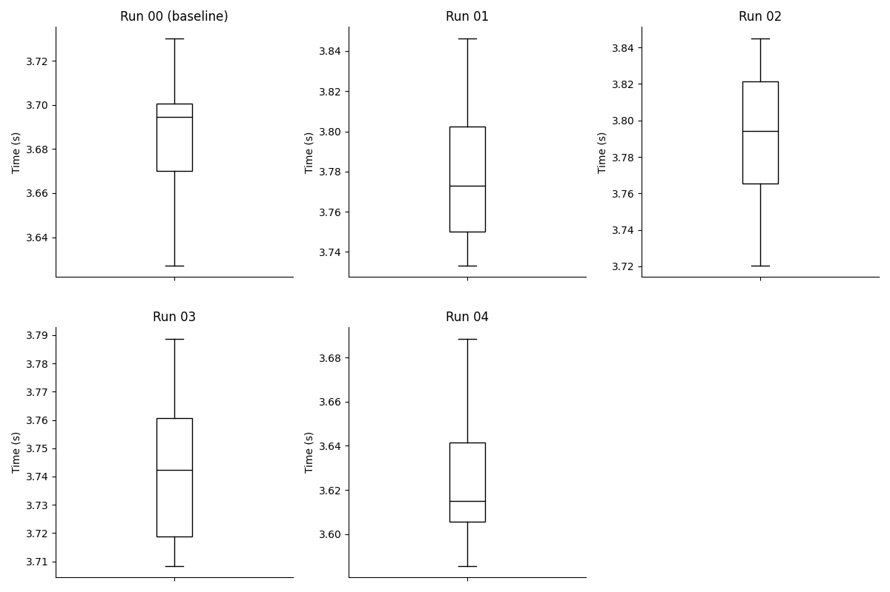

The flamegraph profiles taken after each optimization also display a similar consistency.

We have not seen a speedup in the underlying program despite the optimizations is related to [Amdhal's law]. The pipeline execution spent only a small fraction of its total execution time in the hot loops which were optimized. This is characterized by tall but narrow towers in the flamegraph profile. To achieve a runtime speedup, we have to focus on the widest towers, as they indicate where the most amount of time is spend.

[Amdhal's law]: https://en.wikipedia.org/wiki/Amdahl%27s_law

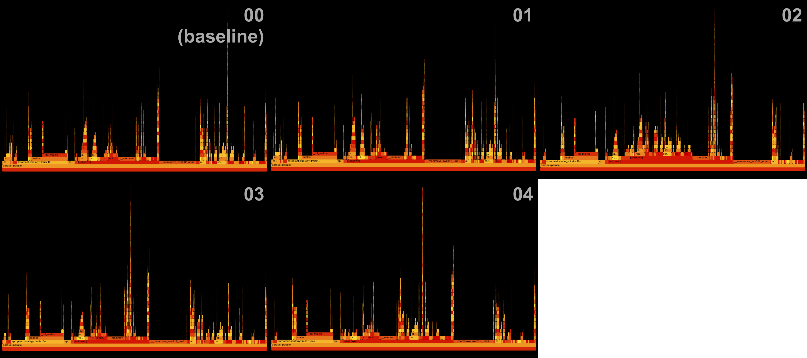

The CPU efficiency has improved across most metrics from the baseline version because of eliminating allocations.

The same program now executes in less CPU cycles, requires less instructions. Reducing heap allocations is particularly noticeable as reduced cache-references, cache-misses, branch-instructions and branch-misses.

Even though the runtime has not changed, the user time metric shows that we have shaved off ~2s (from 28s to under 26s) with these optimizations.

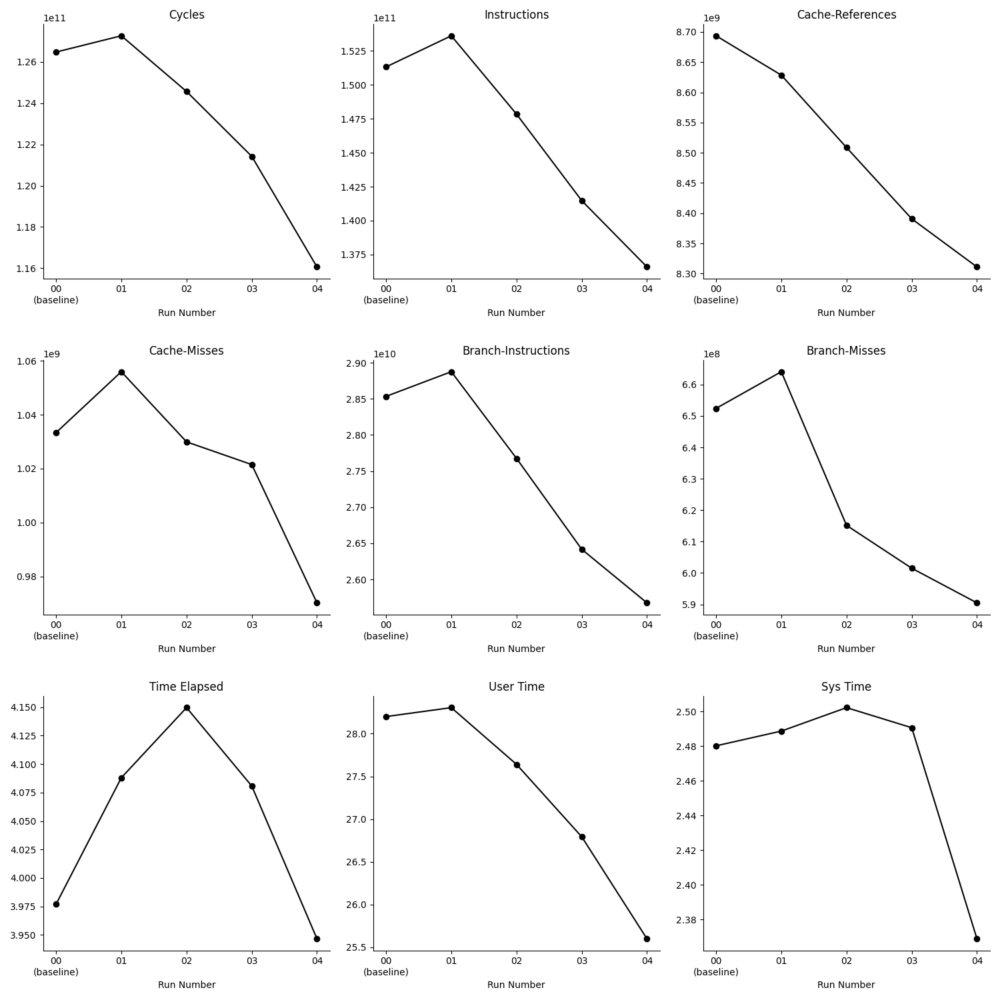

The individual performance counter metrics have improved, but the IPC (instructions per cycle) has gone down from 1.20 to 1.18. Even so, we are now executing the workload using less CPU instructions and cycles. That counts as an efficiency improvement.

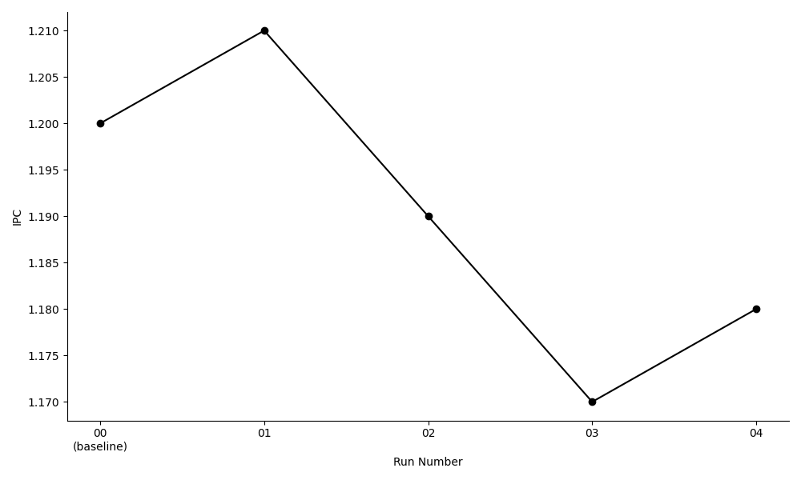

## Phase 2: Architectural Changes

The lesson learned from the previous optimizations, is that to speed up the pipeline we need to focus our efforts on the most time consuming parts of the execution. The most obvious optimization then, is to increase the write throughput, by adding more writers.

We can do a lot better here to improve the speed of the pipeline, by exploiting data parallelism. The data generation is parallelized, but the data encoding to Parquet is not. It is great candidate for making parallel because it is also a compute-bound workload which is now single-threaded.

The size of 10 million rows on disk in Parquet format is ~292MB, and the program takes ~4s to execute. So we know for certain that the writer thread is not I/O bound. We need to be writing an order of magnitude more bytes to disk to saturate the NVME I/O write speeds.

We can also optimize the data generation to speed up the program. It currently depends on [proptest] (a property testing library). I reused it instead of rolling my own, because the [Strategy trait] provides a nice API for defining data skew for the fields of the nested data structure. From the flamegraph profile it is evident that it does a lot more work than which is strictly needed in our case.

[proptest]: https://github.com/proptest-rs/proptest
[Strategy trait]: https://docs.rs/proptest/latest/proptest/strategy/trait.Strategy.html

### 05: Increase Parquet Encoding Bandwidth

The simplest possible thing to do here is to increase the number of writers from one to two. For that we can partition the data generator threads into two retaining the MPSC pattern. Each partition is connected to a Parquet writer. This effectively doubles the encoding bandwidth, and it requires only a minimal lines of code to be changed.

```diff
-    let (tx, rx) = mpsc::sync_channel::<RecordBatch>(num_threads * 2);
+    let (tx1, rx1) = mpsc::sync_channel::<RecordBatch>(num_threads);
+    let (tx2, rx2) = mpsc::sync_channel::<RecordBatch>(num_threads);

+    let writer_handle_1 = create_writer_thread("contacts_1.parquet", rx1);
+    let writer_handle_2 = create_writer_thread("contacts_2.parquet", rx2);

     let chunk_count = target_contacts.div_ceil(BASE_CHUNK_SIZE);
     let parquet_schema = get_contact_schema();

     (0..chunk_count)
         .into_par_iter()
-        .for_each_with(tx, |tx, chunk_index| {
+        .for_each_with((tx1, tx2), |(tx1, tx2), chunk_index| {
             let start_index = chunk_index * BASE_CHUNK_SIZE;
             let current_chunk_size = std::cmp::min(BASE_CHUNK_SIZE, target_contacts - start_index);

@@ -263,11 +275,17 @@ fn main() -> Result<(), Box<dyn Error + Send + Sync>> {
                 to_record_batch(parquet_schema.clone(), &phone_id_counter, partial_contacts)
                     .expect("Failed to create RecordBatch");

-            tx.send(record_batch).unwrap();
+            if chunk_index % 2 == 0 {
+                tx1.send(record_batch).unwrap();
+            } else {
+                tx2.send(record_batch).unwrap();
+            }
         });

     // Teardown
-    writer_handle.join().unwrap()?;
+    writer_handle_1.join().unwrap()?;
+    writer_handle_2.join().unwrap()?;
+
```

This shaved off ~1s (3.6s to 2.7s) from execution time. This is significant, and I need to now find if adding more writers will further reduce the runtime. The major gains are not going to come from this it.

### 06: Make Data Generation Lightweight

The flamegraph profile shows that over 80% of the pipeline execution time is spend in the data generation methods. It is the most dominant factor we need to focus on. Around 20% of that time is spend in [Strategy::new_tree] alone, which is the entry point for data generation.

There is a lot of performed here which does not contribute to data generation, but is necessary for a test runner. We can eliminate this extra work by implementing light-weight functions, but keeping the ergonomic API design.

Maybe, I could have done better at the beginning by rolling my own implementation. But the goal at the beginning was to have a correct, simple working implementation. Performance is important, but it will have been pure guesswork if I had predicted that this will so dominant in the runtime. The other reason is I like the ergonomic API design, which I can copy in the light-weight implementation.

The diff below shows the implementation for the `phone_type` field in the nested data structure. You can see the structural similarities between the old and new versions of the code.

[Strategy::new_tree]: https://docs.rs/proptest/latest/proptest/strategy/trait.Strategy.html#tymethod.new_tree

```diff
-// A Zipfian-like categorical distribution for `phone_type`
-//
-// | Phone Type | Probability |
-// |------------|-------------|
-// | Mobile     | 0.55        |
-// | Work       | 0.35        |
-// | Home       | 0.10        |
-//
-fn phone_type_strategy() -> BoxedStrategy<PhoneType> {
-    prop_oneof![
-        55 => Just(PhoneType::Mobile),
-        35 => Just(PhoneType::Work),
-        10 => Just(PhoneType::Home),
-    ]
-    .boxed()
+fn generate_phone_type(rng: &mut impl Rng) -> PhoneType {
+    match rng.random_range(0..100) {
+        0..=54 => PhoneType::Mobile, // 0.55
+        55..=89 => PhoneType::Work,  // 0.35
+        _ => PhoneType::Home,        // 0.10
+    }
+}
+
```

This refactoring has to be applied uniformly for every field and methods which compose nested fields. The diff below shows how the property-testing runner is replaced with a simple for loop. In this refactoring we completely eliminate the `proptest` dependency.

```diff
diff --git a/Cargo.lock b/Cargo.lock
index 626375c..a6b06a8 100644
--- a/Cargo.lock
+++ b/Cargo.lock
@@ -2322,7 +2322,7 @@ dependencies = [
  "log",
  "parquet",
  "parquet-common",
- "proptest",
+ "rand 0.9.1",
  "rayon",
 ]

diff --git a/crates/parquet-parallel-nested/src/main.rs b/crates/parquet-parallel-nested/src/main.rs
index f6d8610..0fa2083 100644
--- a/crates/parquet-parallel-nested/src/main.rs
+++ b/crates/parquet-parallel-nested/src/main.rs
+
+fn generate_contacts_chunk(size: usize, seed: u64) -> Vec<PartialContact> {
+    let mut rng = StdRng::seed_from_u64(seed);
+    let mut contacts = Vec::with_capacity(size);
+    let mut name_buf = String::with_capacity(32);
+
+    for _ in 0..size {
+        contacts.push(generate_partial_contact(&mut rng, &mut name_buf));
+    }
+
+    contacts
 }
-
-fn generate_contacts_chunk(size: usize, seed: u64) -> Vec<PartialContact> {
-    let mut runner = TestRunner::new(Config {
-        rng_seed: RngSeed::Fixed(seed),
-        ..Config::default()
-    });
-
-    let strategy = proptest::collection::vec(contact_strategy(), size);
-    strategy
-        .new_tree(&mut runner)
-        .expect("Failed to generate chunk of partial contacts")
-        .current()
-}
```

The pipeline is now 2.3x faster. The total runtime decreased from 2.70s to 1.18s (~1.5s). The IPC (instructions per cycle) nearly doubled, from 1.05 to 2.02. Every other stat shows similar improvements.

This is a strong result. The program speed increased, and it is also now more efficient in core utilization.

### 07: Increase Parquet Writer Threads

The Parquet encoding step remains a bottleneck as the data generators outpace the two writer threads. A simple test is to see the effect of doubling the writers again.

```diff
-    if chunk_index % 2 == 0 {
-            tx1.send(record_batch).unwrap();
-        } else {
-            tx2.send(record_batch).unwrap();
-        }
-    });
+    let record_batch =
        to_record_batch(parquet_schema.clone(), &phone_id_counter, partial_contac
ts)
+       .expect("Failed to create RecordBatch");
+
+    match chunk_index % 4 {
+        0 => s1.send(record_batch).expect("Failed to send to rx1"),
+        1 => s2.send(record_batch).expect("Failed to send to rx2"),
+        2 => s3.send(record_batch).expect("Failed to send to rx3"),
+        _ => s4.send(record_batch).expect("Failed to send to rx4"),
+    }
```

Another ~1.5x speedup in runtime. The total runtime dropped below a second (800ms) for the first time. On the other hand, the IPC dropped to 1.76 from the previous high.

### 08: Introduce Thread-Local State

The flamegraph profile now shows that around 20% of the time is spend in resizing vectors, and cloning strings in data generation.

The current data generation is stateless. As soon as a chunk of nested records are created, a `RecordBatch` is created. And this is immediately send to the writer thread. The chunk size setting is hard-coded as 256. It creates ~39K `RecordBatches` for 10 million records. We could increase chunk size, but a better thing to do here is decouple the chunk size from the row count at which we finalize a `RecordBatch`, so that they can be tuned separately.

For example, if the chunk size is 256, we can configure a `RecordBatch` to be finalized when we have 5K nested records. Now only ~2K `RecordBatch`es are created for a run of 10 million records. For this we introduce `GeneratorState` struct which contains the `RecordBatch` fields to which we are appending the chunk values.

```diff
+struct GeneratorState {
+    schema: SchemaRef,
+    name: StringBuilder,
+    phone_number_buf: String,
+    counter: Arc<AtomicUsize>,
+    phones: ListBuilder<StructBuilder>,
+    current_chunks: usize,
+}
+
+enum GeneratorStateError {
+    NotEnoughChunks { current: usize, required: usize },
+    TryFlushZeroChunks,
+}
+
@@ -411,38 +351,95 @@ fn main() -> Result<(), Box<dyn Error + Send + Sync>> {
         .num_threads(num_producers)
         .build()
         .unwrap();
-
     pool.install(|| {
         let chunk_count = target_contacts.div_ceil(BASE_CHUNK_SIZE);
         let parquet_schema = get_contact_schema();

+        (0..num_producers).into_par_iter().for_each(|producer_id| {
+            // Each thread gets its own state and a clone of the senders.
+            let mut generator_state =
+                GeneratorState::new(parquet_schema.clone(), phone_id_counter.clone());
```

This reduces the runtime by another 25% (~800ms to ~600ms). We have also regained IPC and it is at an all time high of 2.21. Every efficiency parameter has improved.

Yet another significant improvement both in speedup and efficiency of the program's execution.

### Measuring Impact

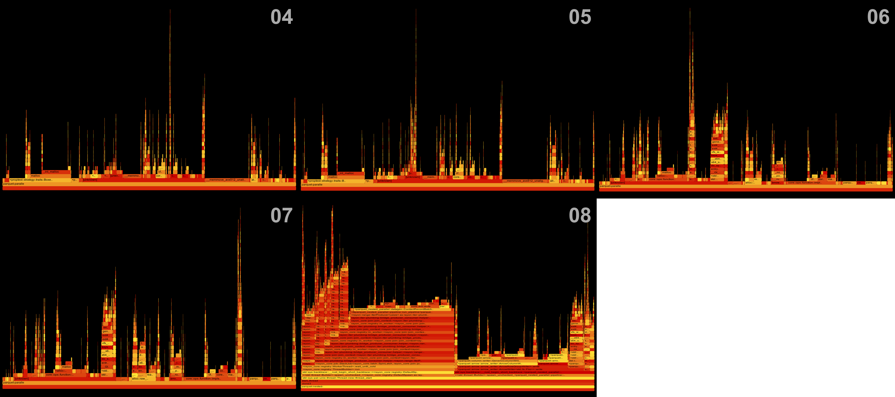
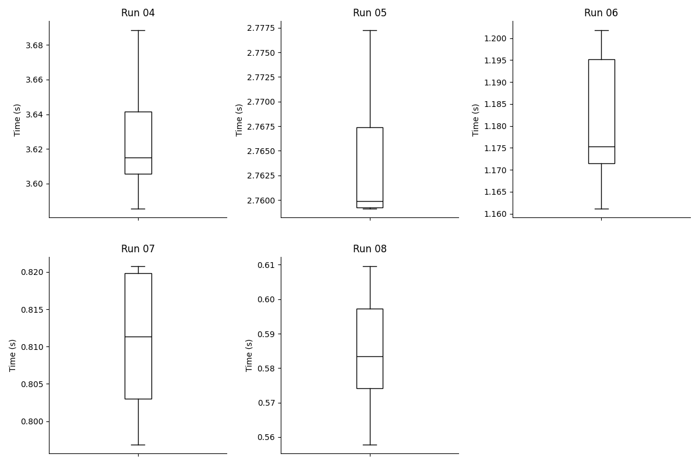
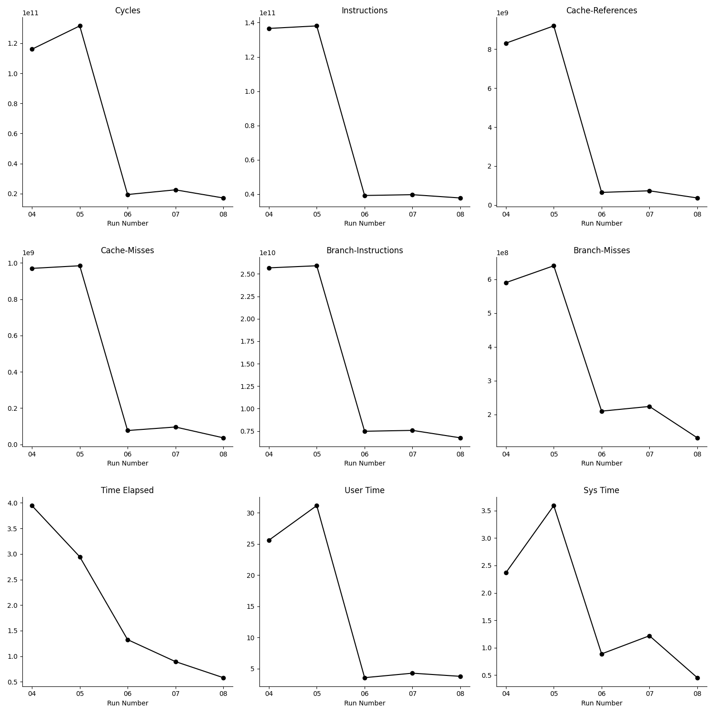
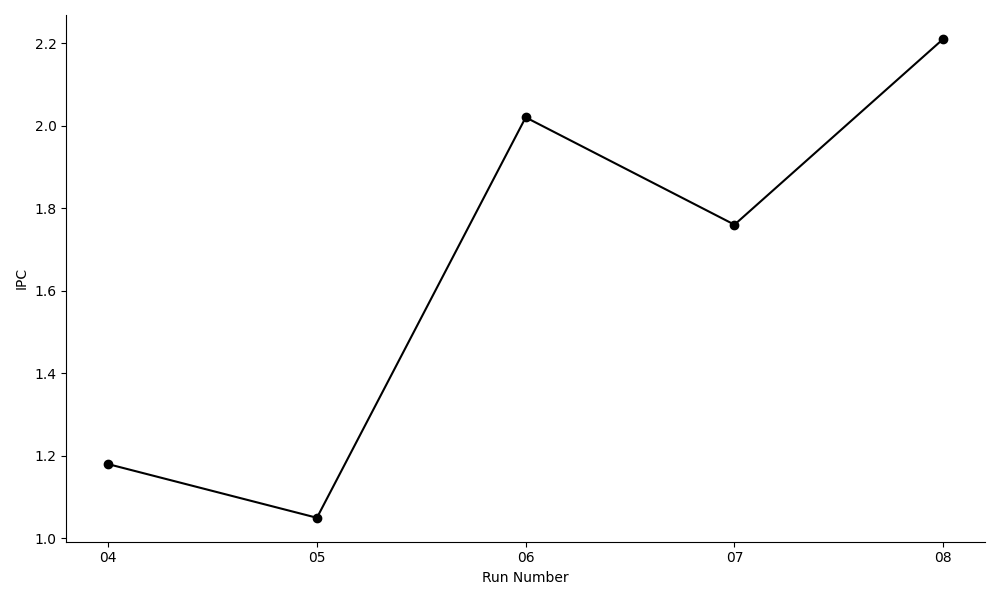

## Phase 3: A Performance Regression

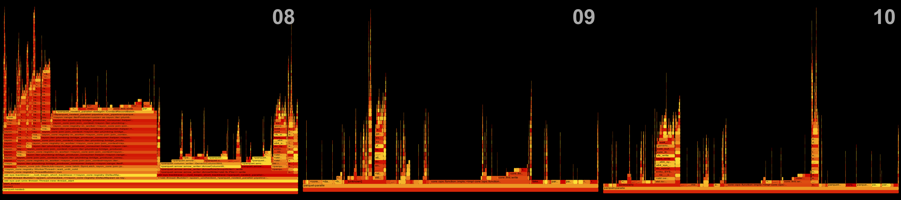
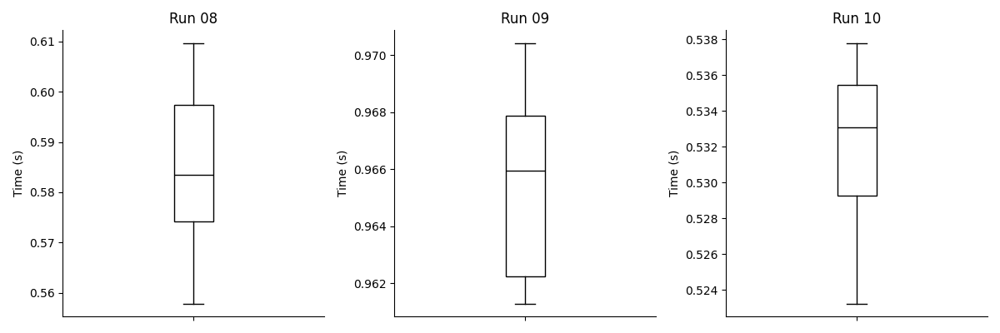
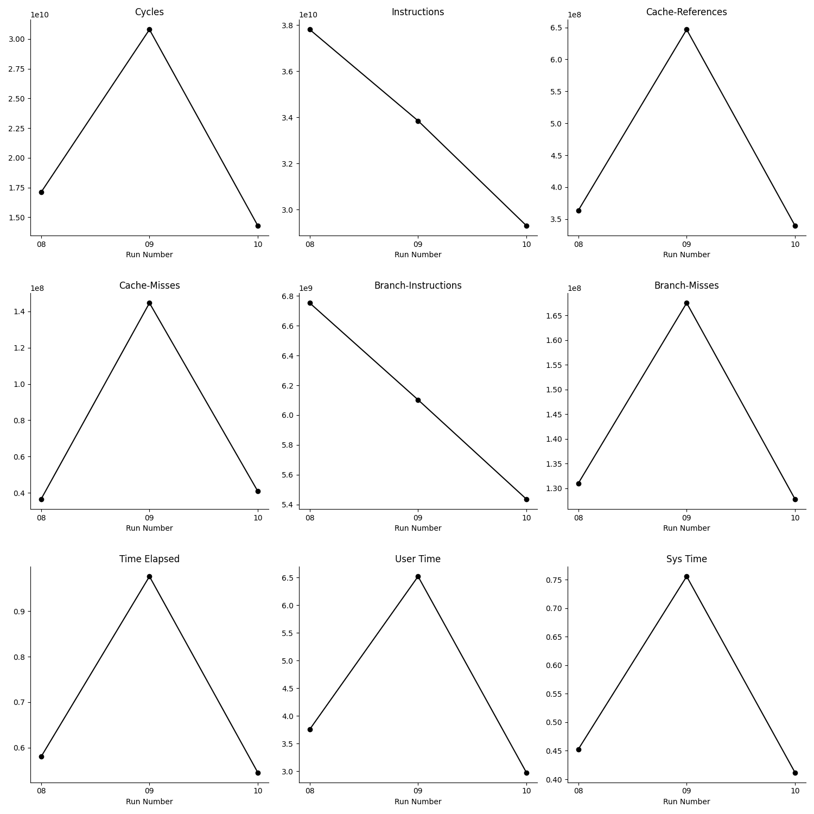
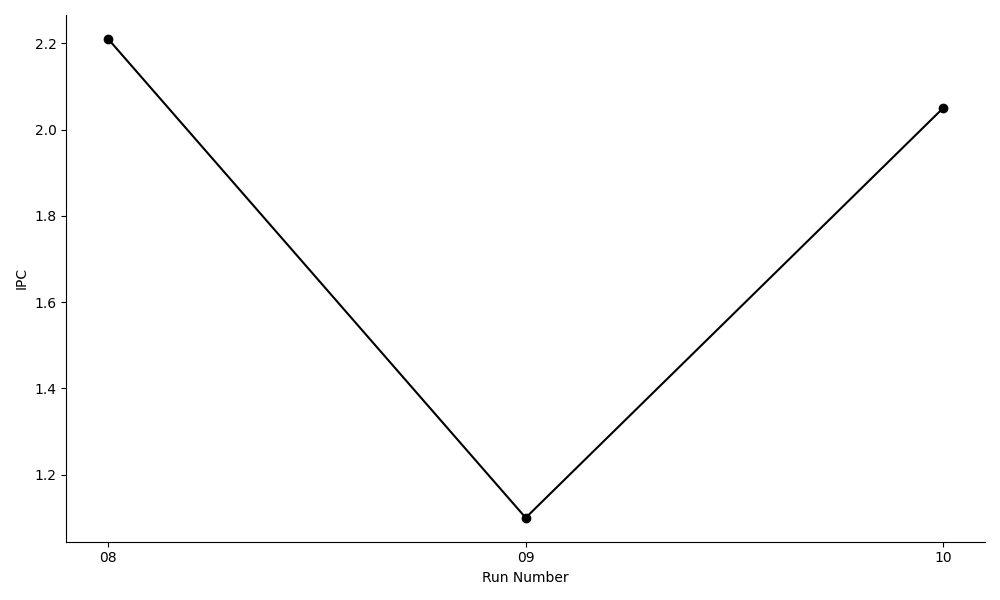

## Phase 4: Micro-optimizations

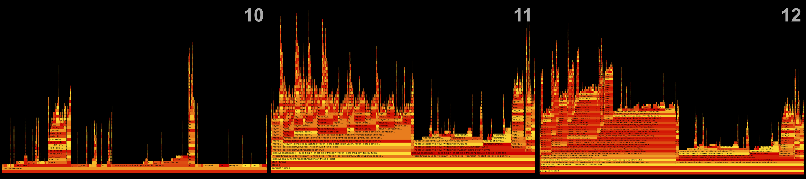
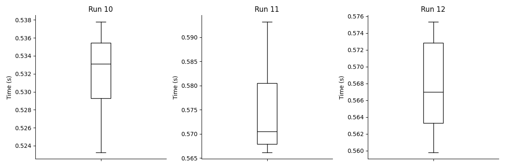
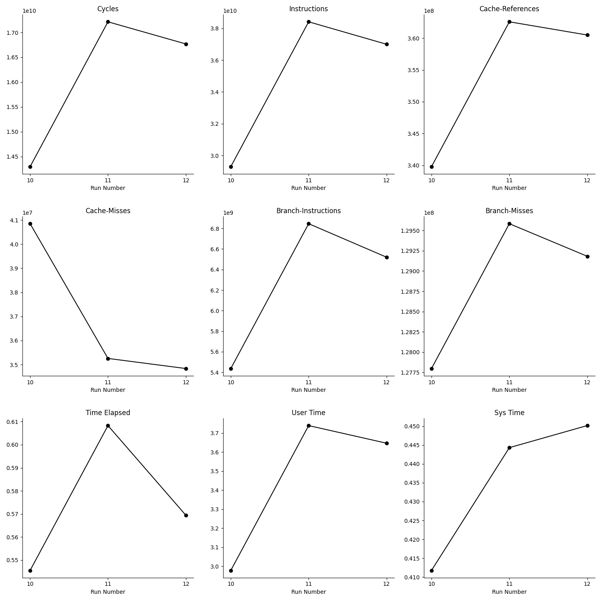
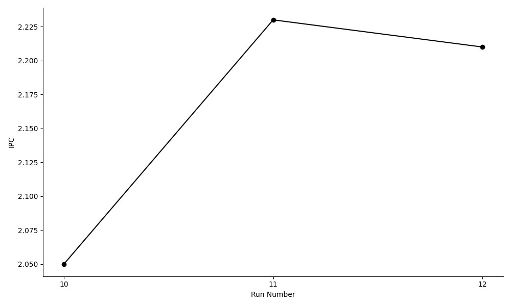
