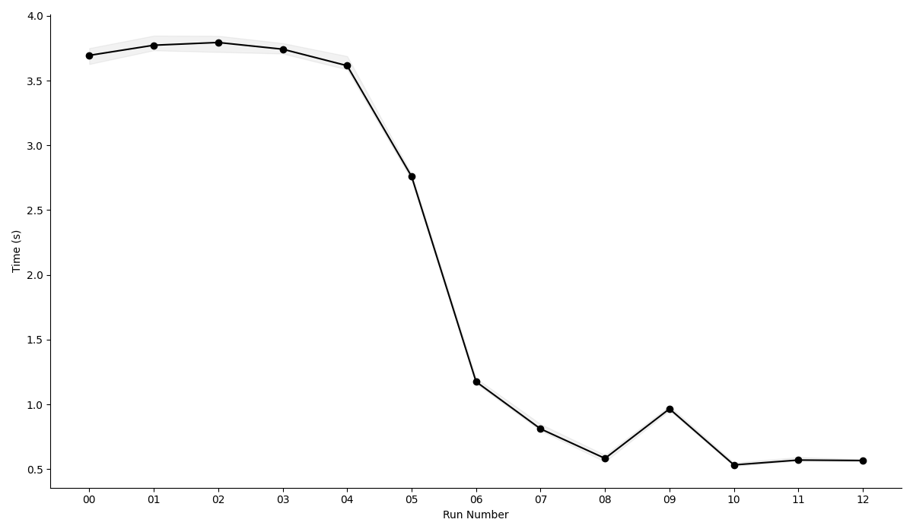

Lately, I've been poking around record shredding and needed a dataset of nested data structures for tracing query execution over shredded data. For this, I implemented a data generator which follows a [Zipfian-like] distribution. The generated data is staged in-memory as [Arrow RecordBatches], and then written to disk as Parquet files.

[Zipfian-like]: https://en.wikipedia.org/wiki/Zipf%27s_law
[Arrow RecordBatches]: https://arrow.apache.org/rust/parquet/arrow/index.html

```rust
    let config = PipelineConfigBuilder::new()
        .with_target_records(cli.target_records)
        .with_num_writers(cli.num_writers)
        .with_record_batch_size(cli.record_batch_size)
        .with_output_dir(output_dir)
        .with_output_filename(cli.output_filename)
        .with_arrow_schema(get_contact_schema())
        .try_build()?;

    let factory = ContactGeneratorFactory::from_config(&config);
    let metrics = run_pipeline(&config, &factory)?;
```

The first version was a simple pipeline using Rust MPSC which connects multiple data generation (producer) threads to a single Parquet writer (consumer) thread. It took around ~3.7s to generate a dataset containing 10 million rows. Then after applying a sequence of optimizations, the final runtime is ~440ms (8x speedup). 

You can see below the effect on runtime as each optimization is applied. The measurements were made using [hyperfine]:

```text
$ ~/.cargo/bin/hyperfine --warmup 1 \
    --runs 10 \
    --prepare 'sync; echo 3 > /proc/sys/vm/drop_caches'
```
[hyperfine]: https://github.com/sharkdp/hyperfine




<figcaption>Fig 1. Total runtime measured after each optimization step (lower is better). The x-axis represents the sequence of optimizations, where the zeroth runtime is the runtime of the baseline version of the program before any optimizations were applied. The y-axis represents the total runtime.</figcaption>

From the chart we can see that not all optimizations had an impact on runtime. Even so, as we will see later it contributed to improving the efficiency of the pipeline as observed through hardware performance counter measurements.

No. `09` is a string interning optimization which seemed like an obvious win, but turned out to be bad for performance in practice. Later, in this post we will get into the details, and try to understand the reason for the performance regression. In no. `10`, the changes were reverted to get back to the previous baseline.

All benchmarks were run on a Linux machine with the following configuration:
- Ubuntu 24.04.2 LTS (Kernel 6.8)
- AMD Ryzen 7 PRO 8700GE (8 Cores, 16 Threads)
- 64 GB of DDR5-5600 ECC RAM
- 512 GB NVMe SSDs.

